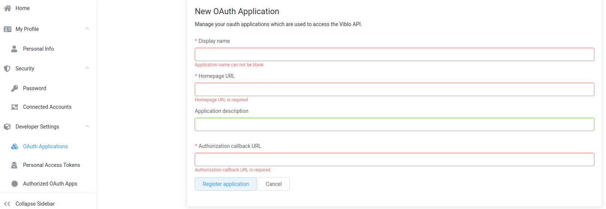

# Integrate-Login
- Đặt vấn đề: Giả sử bạn đang sử dụng khoảng 10 app trở lên, và mỗi app cần phải có tài khoản để đăng nhập. Vì vậy, việc ngồi đăng ký và ghi nhớ thông tin đăng nhập cho mỗi app thực sự là một thảm họa, đặc biệt hơn là mỗi app bạn lại đặt username và password khác nhau (omg).
- Thật may, nhận ra điều này các ông lớn như Facebook, Twitter, Google đã đàm phán với nhau và đưa ra chuẩn mới **Open Authentication**.

# Introduction OAuth2
- OAuth2 là một framework, một **phương thức chứng thực** giúp các ứng dụng có thể chia sẻ tài nguyên với nhau mà không cần chia sẻ thông tin đăng nhập (username, password).
- Từ **Auth** có 2 ý nghĩa:
  + Authentication: Xác thực người dùng thông qua việc đăng nhập.
  + Authorization: Cấp quyền truy cập vào các resource.
- Quay lại phần đặt vấn đề một chút, bây giờ bạn chỉ cần có một tài khoản Facebook/Google/Twitter là bạn có thể đăng nhập vào nhiều ứng dụng khác nhau mà không phải nhớ tài khoản nữa (awesome)

- OAuth2 làm việc với 4 đối tượng với các vai trò khác nhau:
  + Resource Owner (User): là chủ sở hữu dữ liệu muốn chia sẻ. Quyền truy cập vào dữ liệu của người dùng được giới hạn trong phạm vi được cấp (quyền truy cập đọc hoặc ghi)
  + Client (Application): Là ứng dụng muốn truy cập vào dữ liệu của người dùng. Cần phải được người dùng ủy quyền và được xác thực bởi API (Facebook, Twitter, Google...)
  + Resource Server (API): là server chứa thông tin dữ liệu cần chia sẻ.
  + Authorization Server (API): Kiểm tra thông tin người dùng, sau đó cung cấp **token** để truy cập vào dữ liệu cho client
  
## OAuth2 hoạt động như thế nào?

## Đăng ký thông tin cho ứng dụng
- Trước khi sử dụng OAuth, bạn phải đăng ký ứng dụng của mình với nhà cung cấp dịch vụ (Facebook, Google...). Bạn sẽ phải cung cấp các thông tin như:
  + Application Name: Tên ứng dụng
  + Application Website: Website của ứng dụng
  + Redirect URI or Callback URL: Địa chỉ quay lại khi quá trình ủy quyền hoàn tất
- Sau khi đăng ký thành công, dịch vụ sẽ cung cấp **client credentials** bao gồm các thông tin:
  + **client identifier** (Client ID): là chuỗi công khai được API sử dụng để xác định ứng dụng và để xây dựng các URL ủy quyền hiển thị phía user.
  + **client secret** được giữ bí mật giữa ứng dụng và API, dùng để xác thực định danh của ứng dụng với API khi ứng dụng yêu cầu truy cập thông tin tài khoản user.
- Các thông tin quản lý ứng dụng dạng như sau:

## Authorization Grant
- Theo như Flow trên, 4 bước đầu tiên sử dụng để lấy ủy quyền (authorization grant) và access token. **Authorization grant type** phụ thuộc vào phương thức sử dụng để yêu cầu ủy quyền. OAuth2 định nghĩa 4 loại grant type:
  + Authorization Code: Sử dụng với các ứng dụng phía Server
  + Implicit: Sử dụng với các Mobile App (ứng dụng chạy trên thiết bị của user) hoặc Web App (Browser App)
  + Resource Owner Password Credentials: Sử dụng với các ứng dụng đáng tin cậy, ví dụ như các ứng dụng do chính service sở hữu.
  + Client Credentials: Sử dụng vơí ứng dụng truy cập thông qua API.
### Grant type: Authorization Code
- Đây là loại cấp mã ủy quyền được sử dụng phổ biến nhất vì nó tối ưu hóa cho các ứng dụng phía server, nơi source code không công khai và **client secret** được duy trì bảo mật.
- Đây là luồng dựa trên chuyển hướng, nên ứng dụng phải có khả năng tương tác với tác nhân người dùng (user-agent) và nhận API authorization code thông qua user-agent.
- Flow:

  + Yêu cầu authorization code: Đầu tiên user được cung cấp một liên kết để nhận **authorization code** có dạng như sau:
  <pre class="code-pre "><code langs="">https://cloud.digitalocean.com/v1/oauth/authorize?response_type=code&amp;client_id=CLIENT_ID&amp;redirect_uri=CALLBACK_URL&amp;scope=read
</code></pre>

  + Người dùng ủy quyền cho ứng dụng:
  
  
  + Application nhận Authorization Code: Khi user cho phép quyền truy cập, dịch vụ sẽ chuyển hướng người dùng đến URI(đã được đăng ký trước đó), Applicaiton sẽ lưu lại **authorization code**
  <pre class="code-pre "><code langs="">https://dropletbook.com/callback?code=AUTHORIZATION_CODE</code></pre>
  
  + Application yêu cầu Access Token:
  <pre class="code-pre "><code langs="">https://cloud.digitalocean.com/v1/oauth/token?client_id=CLIENT_ID&amp;client_secret=CLIENT_SECRET&amp;grant_type=authorization_code&amp;code=AUTHORIZATION_CODE&amp;redirect_uri=CALLBACK_URL
</code></pre>

  + Application nhận Access Token:
  <pre class="code-pre "><code langs="">{"access_token":"ACCESS_TOKEN","token_type":"bearer","expires_in":2592000,"refresh_token":"REFRESH_TOKEN","scope":"read","uid":100101,"info":{"name":"Mark E. Mark","email":"mark@thefunkybunch.com"}}
</code></pre>

### Grant type: Implicit
- Được sử dụng cho mobile apps và web application, nơi **client secret** không được bảo mật.
- Được coi như một **redirection-based flow** trong đó **access token** được đưa đến Application thông qua Browser. Do đó, phương thức ủy quyền này không xác thực ID của ứng dụng mà tin tưởng hoàn toàn vào **redirect URI**.
- Không support **refresh tokens**.
- Flow: Ta có thể hiểu đơn giản luồng hoạt động như sau: Application gửi yêu cầu ủy quyền đến User, sau đó Authorization Server truyền thằng access token đến Browser và sau đó truyền lại cho Application.

  + User yêu cầu access_token: Tương tự Authorization Code, chỉ khác ở tham số response_type=token
  <h3 id="step-2-user-authorizes-application">Step 2: User Authorizes Application</h3>
  
  + User ủy quyền cho Application: Tương tự Authorization Code
  + Browser nhận access_token thông qua Redirect URI:
  <pre class="code-pre "><code langs="">https://dropletbook.com/callback#token=ACCESS_TOKEN
</code></pre>

  + Browser duy trì access_token: Sau khi được chuyển hướng về **redirect_uri**, nhiệm vụ của Browser là duy trì **access_token**. Ngoài ra tùy từng Service sẽ có thêm những tham số khác để điều hướng quay trở lại ứng dụng.
  + Application trích xuất access_token: Từ URL trả về có chứa **access_token** nhiệm vụ phải thực hiện là trích xuất ra **access_token**
  + access_token được gửi đến Application: Sau khi lấy được **access_token** thì nó sẽ được chuyển về ứng dụng. Đến đây quá trình ủy quyền hoàn tất và ứng dụng có thể sử dụng **access_token**.

### Grant type: Resource Owner Password Credentials
- User cung cấp thông tin đăng nhập trực tiếp cho ứng dụng để lấy **access token** từ service.
- Chỉ nên sử dụng với các ứng dụng được người dùng tin cậy.
- Sau khi user cung cấp thông tin đăng nhập cho ứng dụng, ứng dụng sẽ yêu cầu **access token** từ authorization server.
<pre class="code-pre "><code langs="">https://oauth.example.com/token?grant_type=password&amp;username=USERNAME&amp;password=PASSWORD&amp;client_id=CLIENT_ID
</code></pre>

### Grant type: Client Credentials
- Loại ủy quyền này phục vụ cho việc truy cập vào chính thông tin tài khoản của Application tại service. Ví dụ như Application muốn thay đổi thông tin description hoặc redirect_uri... User không tham gia vào quá trình ủy quyền.
- Flow: Ứng dụng yêu cầu **access token** bằng cách gửi thông tin đăng nhập (client ID và client secret) là có thể thực hiện quá trình ủy quyền:
<pre class="code-pre "><code langs="">https://oauth.example.com/token?grant_type=client_credentials&amp;client_id=CLIENT_ID&amp;client_secret=CLIENT_SECRET
</code></pre>

## Sử dụng Access Token
- Sau khi đã có **access_token**, có thể sử dụng để truy cập vào tài khoản người dùng thông qua API.
<code langs="">curl -X POST -H "Authorization: Bearer ACCESS_TOKEN""https://api.digitalocean.com/v2/$OBJECT" 
</code>

## Refresh Token Flow
- Nếu **access_token** hết hạn, thì khi sử dụng để gọi API sẽ gặp thông báo lỗi "Invalid Token Error". Đừng lo, nếu Service hỗ trợ cơ chế **refresh token** ta có thể sử dụng để yêu cầu **access_token** mới.
<code langs="">https://cloud.digitalocean.com/v1/oauth/token?grant_type=refresh_token&amp;client_id=CLIENT_ID&amp;client_secret=CLIENT_SECRET&amp;refresh_token=REFRESH_TOKEN
</code>
